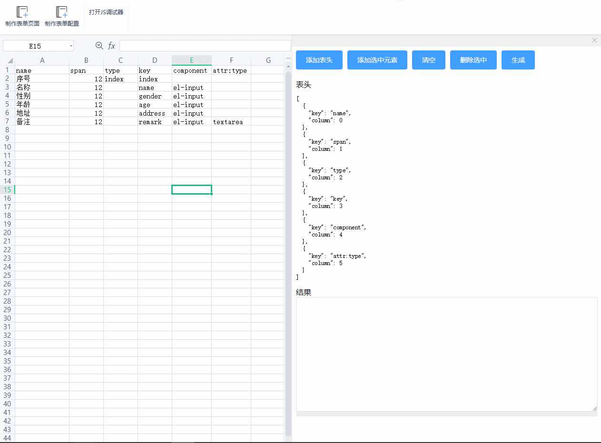

# wps版配置生成工具
> 通过wps表格生成标准json配置，常用于自定义搭建配置界面生成

## 了解
### 效果

### 优势
传统企业本身利用excel表格较多，方便直接从文件转录配置文件
### 安装体验
找到WPS的安装目录，在目录中找oem.ini
文件内容做修改如下
```ini
[Support]
JsApiPlugin=true
JsApiShowWebDebugger=true

[Server]
JSPluginsServer=http://wps-config-addon.flashtd1.com
```
* Support部分，JsApiPlugin是允许使用插件
* Support部分，JsApiShowWebDebugger是开启插件的调试窗口，如果是发布就不要配置这个了
* Server部分，JSPluginsServer是配置插件的下载地址，jsplugins.xml文件要上传到这个地址中，本案例是wps-config-addon.flashtd1.com
* 
## 二次开发
## 项目安装
将项目克隆至本地
```
npm install
```
### 开发
```
npx wpsjs debug
```

### 构建
```
npx wpsjs build
```

### 其他配置参考vue
See [Configuration Reference](https://cli.vuejs.org/config/).

### wps加载项开发说明
先找到wps.exe所在目录
找到cfgs目录，修改oem.ini文件
在底部加上如下代码
```ini
[Support]
JsApiPlugin=true
JsApiShowWebDebugger=true
```
### 发布
在项目地址执行`npx wpsjs build`编译代码
按照提示将生成的wps-addon-build目录部署到服务器